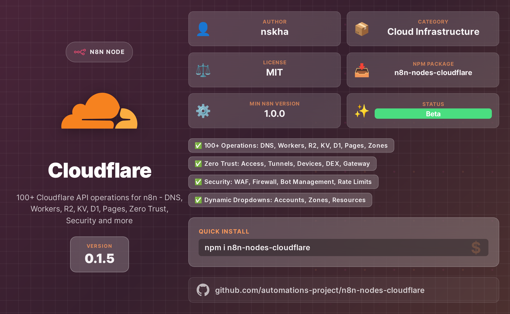

# n8n-nodes-cloudflare

[](https://github.com/Automations-Project/n8n-nodes-cloudflare/actions/workflows/ci.yml)
[](https://docs.n8n.io/integrations/community-nodes/)
[](https://developers.cloudflare.com/api/)
[](#contributing)
[](#-contributing)
[](https://www.npmjs.com/package/n8n-nodes-cloudflare)
[](https://www.npmjs.com/package/n8n-nodes-cloudflare)
[](https://github.com/Automations-Project/n8n-nodes-cloudflare)
[](https://nodejs.org)
[](https://www.typescriptlang.org)
[](LICENSE)

[](https://github.com/Automations-Project/n8n-nodes-cloudflare/stargazers)
[](https://github.com/Automations-Project/n8n-nodes-cloudflare/network)
[](https://github.com/Automations-Project/n8n-nodes-cloudflare/issues)
[](https://github.com/Automations-Project/n8n-nodes-cloudflare/commits)



Comprehensive n8n community nodes for **Cloudflare** - manage your entire Cloudflare infrastructure from n8n workflows.

## ✨ Features

| Category                | Services                                                       |
| ----------------------- | -------------------------------------------------------------- |
| **Core Infrastructure** | DNS, Zones, Cache, SSL/TLS, Page Rules                         |
| **Developer Platform**  | Workers, Pages, D1, KV, R2, Queues, Durable Objects, Vectorize |
| **Security**            | Firewall, WAF, Bot Management, Rate Limits, Zero Trust, Access |
| **Media**               | Stream, Images, Calls                                          |
| **Analytics**           | Radar, Logpush, RUM, DEX                                       |
| **Networking**          | Load Balancer, Argo, Tunnels, Spectrum, Magic Transit          |

**100+ Cloudflare API operations** with dynamic dropdowns for accounts, zones, and resources.

## 📦 Installation

### n8n Community Nodes (Recommended)

1. Go to **Settings → Community Nodes**
2. Click **Install**
3. Enter: `n8n-nodes-cloudflare`
4. Click **Install**

### npm

```bash
npm install n8n-nodes-cloudflare
```

## 🔑 Credentials

Create Cloudflare API credentials in n8n:

1. Go to **Credentials → New**
2. Search for **Cloudflare API**
3. Enter your Cloudflare **API Token** or **API Key + Email**

**Recommended:** Use API Tokens with minimal required permissions.

## 📚 Available Nodes

### Primary Nodes

| Node                      | Description                                                    |
| ------------------------- | -------------------------------------------------------------- |
| **Cloudflare DNS**        | Manage DNS records, analytics, firewall, secondary DNS         |
| **Cloudflare Workers**    | Deploy scripts, KV bindings, AI inference, dispatch namespaces |
| **Cloudflare Zones**      | Zone settings, cache, page rules, waiting rooms, snippets      |
| **Cloudflare Zero Trust** | Access apps, tunnels, devices, DEX, gateway rules              |
| **Cloudflare Security**   | WAF rulesets, bot management, rate limits, page shield         |
| **Cloudflare SSL**        | Certificates, mTLS, Origin CA, Total TLS                       |

### Additional Nodes

R2 Storage, D1 Database, Pages, Stream, Images, Queues, Load Balancer, Registrar, Email Routing, Logpush, Radar, and 50+ more specialized nodes.

## 🚀 Quick Start

### Example: Get All DNS Records With filter (Only Proxied - AKA: CF Orange)

```json
{
	"nodes": [
		{
			"parameters": {
				"zoneId": "2454f994f1057a933cf06857ea485578",
				"returnAll": true,
				"filters": {
					"proxied": true
				}
			},
			"type": "CUSTOM.cloudflareDns",
			"typeVersion": 1,
			"position": [208, 0],
			"id": "ba613500-5af9-4a88-8334-1230e875c060",
			"name": "Get many DNS records",
			"credentials": {
				"cloudflareApi": {
					"id": "46t5YxHZ7Xygke2Z",
					"name": "Cloudflare account"
				}
			}
		}
	],
	"connections": {}
}
```

## 🔧 Dynamic Dropdowns

All nodes feature dynamic dropdowns that load data from your Cloudflare account:

- **Accounts** - Select from your Cloudflare accounts
- **Zones** - Choose domains from your account
- **Workers** - Pick deployed worker scripts
- **R2 Buckets** - Select storage buckets
- **KV Namespaces** - Choose key-value stores
- **And more...**

## ⚠️ Installation Notes

n8n requires that all installed nodes have unique internal names. If you have other community node packages installed that register a node with the same name as a node in this package, n8n may throw an installation error.

If you hit this, uninstall the conflicting package and restart n8n.

Example report: https://github.com/Automations-Project/n8n-nodes-cloudflare/issues/2

## 🤖 RAG Workflows (Vector Search)

The **Cloudflare Vectorize** node includes a built-in **RAG (Embed + Store)** resource that combines Workers AI embeddings with Vectorize storage in a single operation:

- **Insert Documents**: Text → Embeddings → Vector Storage
- **Search Documents**: Query → Embedding → Similarity Search

📖 See [docs/RAG-WORKFLOW-GUIDE.md](docs/RAG-WORKFLOW-GUIDE.md) for complete workflow examples.

> **Note:** Native LangChain cluster node integration (Document Loader, AI Agent tool connectors) requires n8n core support and is not available in community nodes. See the documentation for details and how to request this feature from n8n.

## 📋 Requirements

- **n8n** >= 1.0.0
- **Node.js** >= 18.17.0
- **Cloudflare Account** with API access

## 🤝 Contributing

Contributions welcome! Please:

1. Fork the repository
2. Create a feature branch
3. Submit a Pull Request

## 🐛 Issues

Found a bug? [Open an issue](https://github.com/automations-project/n8n-nodes-cloudflare/issues/new/choose)

## 📄 License

[MIT](LICENSE)

## 👤 Author

**nskha** - [@automations-project](https://github.com/automations-project)

## 🔗 Links

- [npm Package](https://www.npmjs.com/package/n8n-nodes-cloudflare)
- [GitHub Repository](https://github.com/automations-project/n8n-nodes-cloudflare)
- [Cloudflare API Docs](https://developers.cloudflare.com/api/)
- [n8n Community Nodes](https://docs.n8n.io/integrations/community-nodes/)
